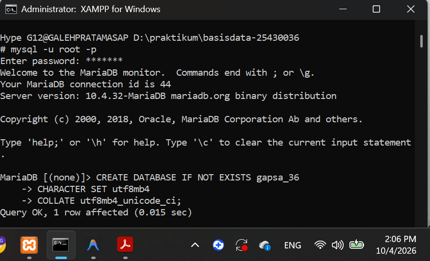
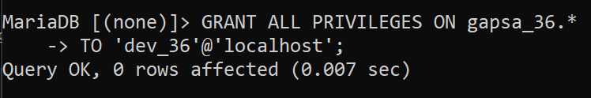
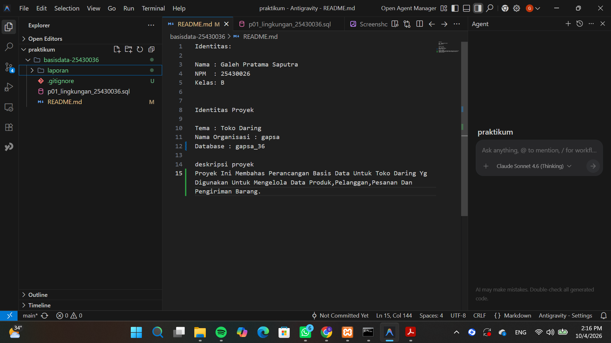
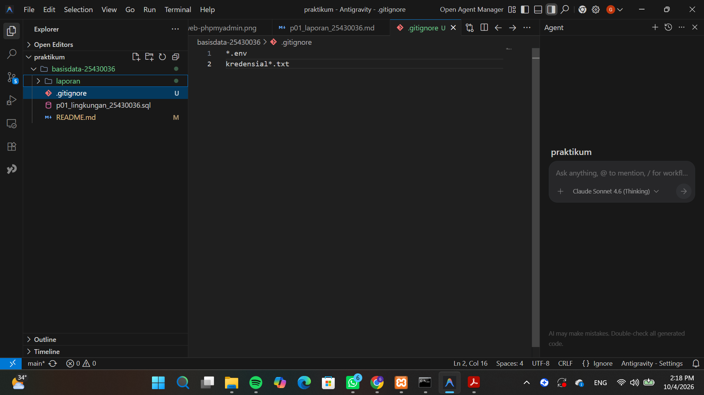
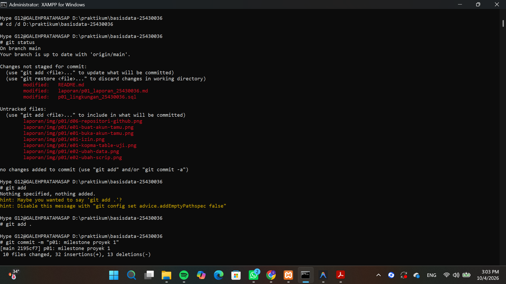
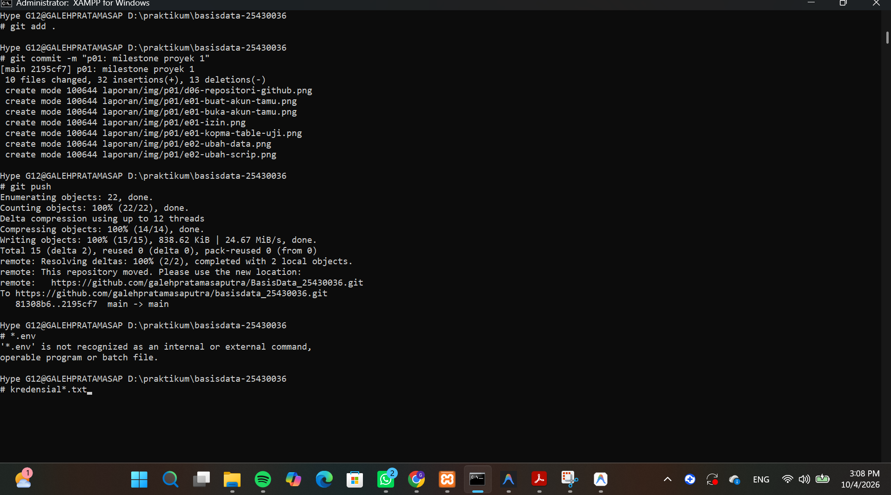
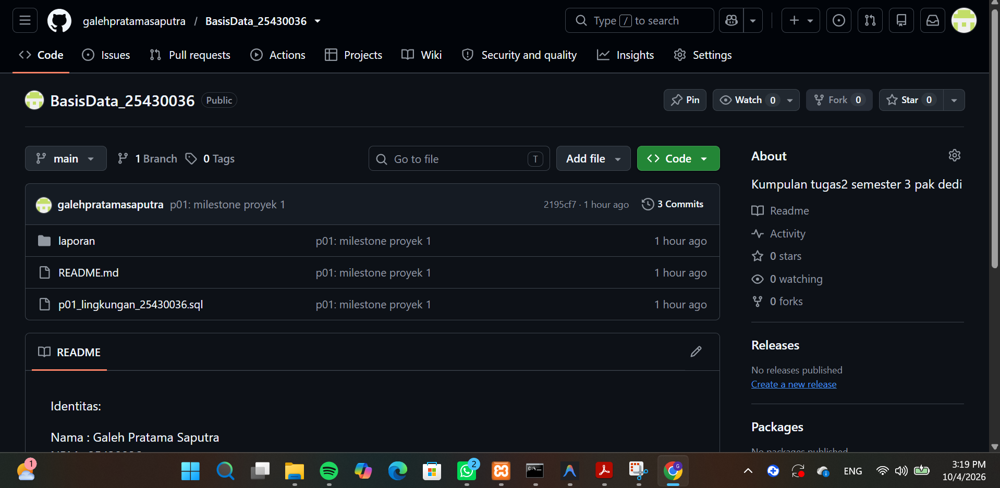

Laporan Praktikum Basis Data - Pertemuan 1

Nama : Galeh Pratama Saputra 
NPM : 25430036 
Kelas : B
Pertemuan : 01  
Tanggal : 5 Oktober 2026 
Nama Dosen : Dedi Irawan, S.Kom., M.T.I. 

1. Tujuan Praktikum

Mahasiswa Mampu Mengelola Cli MariaDB,Mengatur Akun Pengguna,Membuat DataBase Dan Menyimpannya Di Github

2. Ringkasan Dasar Teori

Basis Data Adalah Tempat Menyimpan Data Agar lebih rapi dan mudah di cari,Data ini di kelola menggunakan DBMS dan dapat di kelola menggunakan MariaDB dan bisa di akses menggunakan CLI atau PHPmyadmin.
Sementara itu Git dan Github digunakan untuk menyimpan hasil praktikum dan mencatat perubahan

3. Hasil Langkah Percobaan

D.1 Menjalankan Layanan MariaDB
1. Buka aplikasi XAMPP.
2. Klik tombol start pada baris Apache dan Mysql.
[XAMPP MariaDB berjalan](img/p01/d01-xampp-mariadb.png)

D.2 Masuk Melalui Klien Baris Perintah
1. Klik tombol shell di aplikasi XAMPP itu.
2. Masuk sebagai root.Berhubung saya sudah memiliki pasword sehingga jadi 'mysql -u root -p'.
3. lalu tulis SELECT VERSION(),CURRENT_USER dan SHOW DATABASE yaitu untuk melihat versi MariaDB,mengetahui akun yang sedang di gunakan,melihat database yang di gunakan dan bisa di lihat oleh akun tersebut.
4. kemudian tulis SELECT @@sql_mode; , tujuannya untuk memastikan MariaDB lebih ketat.

D.3 Bikin Akun Root
1. Periksa akun root dengan ketik 'SELECT User,Host FROM mysql.user WHERE User = 'root'; , lalu exit.
2. bikin pasword,Berhubung saya sudah membikin pasword jadi langsung masukkan 'mysql -u root -p

D.4 Bikin Basis Data Dan Akun Kerja
1. ketik CREATE DATABASE kopma_36
CHARACTER SET utf8mb4 COLLATE utf8mb4_unicode_ci;
CREATE USER 'mhs_36'@'localhost' IDENTIFIED BY 'PasswordKerja#36';
GRANT ALL PRIVILEGES ON kopma_36.* TO 'mhs_36'@'localhost';
SHOW GRANTS FOR 'mhs_36'@'localhost'; , Jadi perintah tersebut untuk membuat database dan akun pengguna,Lalu memberikan hak akses pengguna serta memeriksa hak akses yang sudah di berikan, lalu exit.
2. lalu masuk menggunakan 'mysql -u mhs_36 -p lalu masukkan pasword,kemudian ketik SHOW DATABASE; , USE mysql; , perintah tersebut untuk masuk di MariaDB memakai akun kerja,Melihat database yang bisa di akses lalu membuka database untuk menguji batas hak akses akun. 

D.5 Menggunakan phpMyAdmin 
1. Tutup semua jendela peramban, Lalu buka berkas D:\XAMPP\PHPmyadmin\config.inc.php dengan editor teks.
2. cari baris $cfg['server'][$i]['auth_type'] = 'config'; dan ubah nilainya menjadi 'cookie' , Simpan berkas.
3. Buka https://localhost/phpmyadmin/,masuk sebagai mhs_36,buka tab SQL,lalu jalankan.

D.6 Menyiapkan Repositori Git
1. Buat folder kerja, D:\praktikum\basisdata 25430036 lalu buat berkas README.md dan p01_lingkungan_25430036.
2. Isi berkas tersebut dengan perintah yang di jalankan hari ini.
3. Inisialisasi repositori,commit,lalu kirim ke github.

4. Jawaban Titik Analisis

Titik Analisis 1:
"solusi mysql belum cocok untuk mariaDB jadi harus cari solusi yang sesuai agar tidak salah,Dokumentasi mysql untuk maslah umum sedangkan MariaDB untuk masalah khusus".

Titik Analisis 2:
"Pesan galatnya 1045 (28000).Pesan yang memberi tahu klien Di bagian Using password : NO , Pesan galat di shell dan di gambar 1.10 sesuai,Keduanya menunjukkan error 1045 jadi maksudnya akses di tolak karena mencoba masuk tidak mengirim password".

Titik Analisis 3:
"Karena information_scema bisa di lihat karena berisi database sedangkan mysql di tolak karena tidak punya izin akses,
1044 yaitu tidak punya izin akses
1045 yaitu gagal login,seperti password salah".

Titik Analisis 4:
"Karena mode cookie tidak menyimpan password di file konfigurasi,Jadi lebih kecil resiko di curi atau di lihat orang lain".

5. Hasil Latihan dan Modifikasi

E.1

Kode galatnya ERROR 1142(42000) yaitu pengguna tidak punya izin perintah SQL tersebut.

E.2

6. Tugas Mandiri: Milestone Proyek 1

F.1

F.2

F.3

F.4

7. Pembahasan dan Kendala
Selama praktikum ini saya mendapat kendala seperti muncul beberapa error seperti error 1045 yaitu karena masalah password,Cara mengatasinya dengan memasukkan password dengan benar,error 1044 yaitu karena akun tidak memiliki izin untuk mengakses database,Cara mengatasinya yaitu harus mengecek kembali hak akses akun tersebut, dan error 1142 yaitu karena akun tidak memiliki izin unruk menjalan perintah sql tertentu,Cara mengatasinya dengan akun menggunakan izin atau memberikan hak akses yang sesuai.Setelah memahami penyebabnya tersebut,Praktikum bisa di lanjutkan sampai selesai.

8. Kesimpulan

Dari praktikum ini saya belajar menggunakan MariaDB melalui CLI dan PHPmyadmin,Membuat database dan akun pengguna serta mengatur hak akses,Dan saya juga belajar Git danb Github untuk menyimpan hasil praktikum,dengan praktikum ini saya jadi paham cara mengelola database,cara kerja database dan mengetahui hak akses pengguna.

9. Pernyataan Penggunaan AI

Saya menggunakan AI untuk memahami materi dan merapikan kata-kata di laporan,selebihnya saya sesuaikan dengan pemahaman dan hasil praktikum yang saya kerjakan.

10. Bukti Git

Repository: https://github.com/galehpratamasaputra/BasisData_25430036

Commit: https://github.com/galehpratamasaputra/BasisData_25430036/commit/2195cf78a8c3c9b2209b4ce3dbc559876fea86d8

Checklist

- [X] D.1–D.6 selesai
- [X] Titik Analisis 1–4 dijawab
- [X] E.1–E.2 selesai
- [X] Milestone Proyek 1 selesai
- [X] Bukti screenshot lengkap
- [X] Git commit dan push