Laporan Praktikum Basis Data - Pertemuan 1

Nama : Galeh Pratama Saputra 
NPM : 25430036 
Kelas : B
Pertemuan : 01  
Tanggal :  Oktober 2026 
Nama Dosen : Dedi Irawan, S.Kom., M.T.I. 

1. Tujuan Praktikum

Setelah melakukan praktikum ini, mahasiswa diharapkan bisa:

1. Menjalankan dan mematikan MariaDB lewat XAMPP serta melihat status dan port yang digunakan.
2. Mengakses MariaDB menggunakan CLI dan phpMyAdmin.
3. Mengamankan akun root dan membuat akun baru dengan hak akses tertentu.
4. Membuat database dan menyimpan hasil praktikum menggunakan Git dan GitHub.

2. Ringkasan Dasar Teori

Basis data adalah tempat untuk menyimpan data supaya lebih rapi dan mudah dicari. Untuk mengelola data tersebut digunakan DBMS. Dengan DBMS, kita bisa menambah, mengubah, menghapus, dan mencari data.

MariaDB adalah salah satu DBMS yang digunakan dalam praktikum. MariaDB dijalankan lewat XAMPP dan bisa diakses menggunakan CLI atau phpMyAdmin. Keduanya sama-sama digunakan untuk memberi perintah ke database.

Setiap akun MariaDB memiliki hak akses yang berbeda. Root memiliki akses lebih tinggi, sedangkan akun biasa bisa dibatasi sesuai kebutuhan agar database lebih aman. Git dan GitHub digunakan untuk menyimpan hasil praktikum serta mencatat perubahan pekerjaan.

3. Hasil Langkah Percobaan

D.1 Menjalankan Layanan MariaDB

[XAMPP MariaDB berjalan](img/p01/d01-xampp-mariadb.png)
Keterangan

D.2 Masuk Melalui Klien Baris Perintah

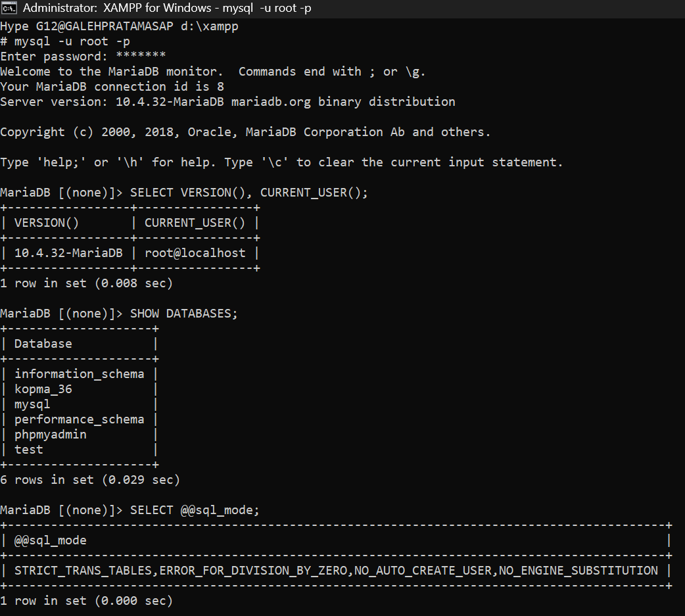
Keterangan:

D.3 Bikin Akun Root

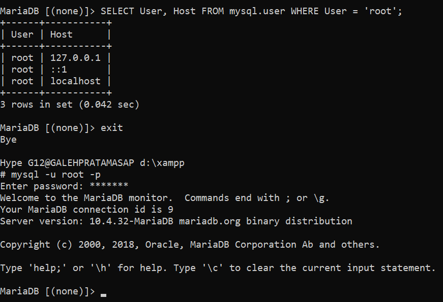
Keterangan:

D.4 Bikin Basis Data Dan Akun Kerja

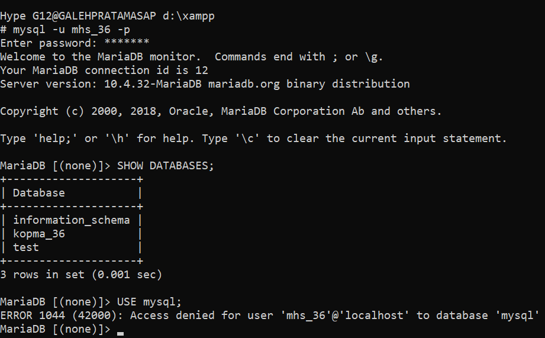
Keterangan:

D.5 Menggunakan phpMyAdmin 

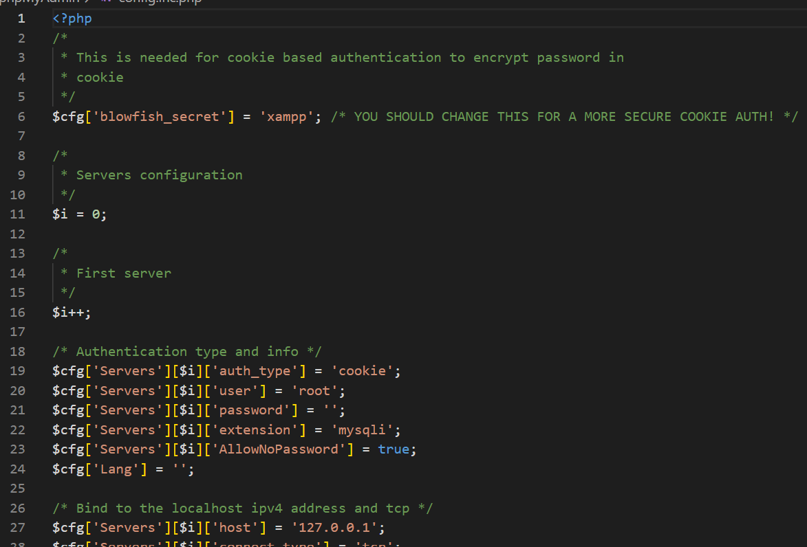
Keterangan:

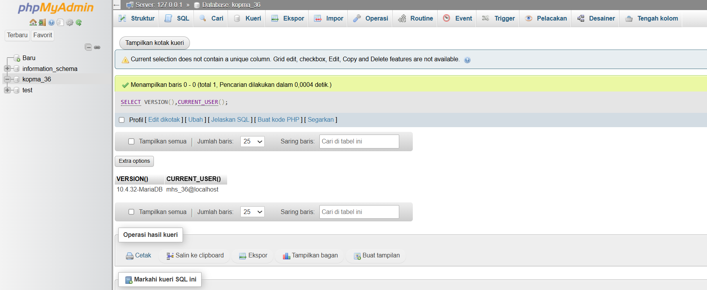
Keterangan:

D.6 Menyiapkan Repositori Git

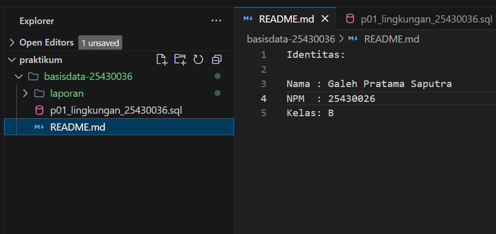
Keterangan:

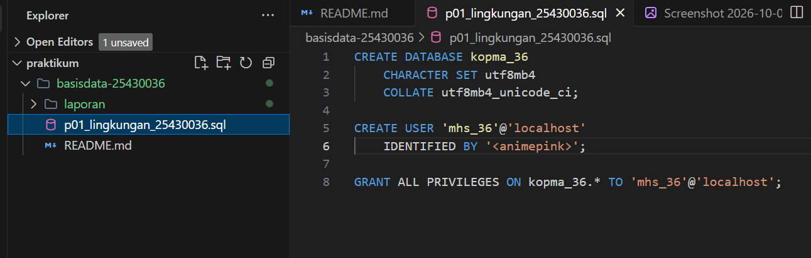
Keterangan:

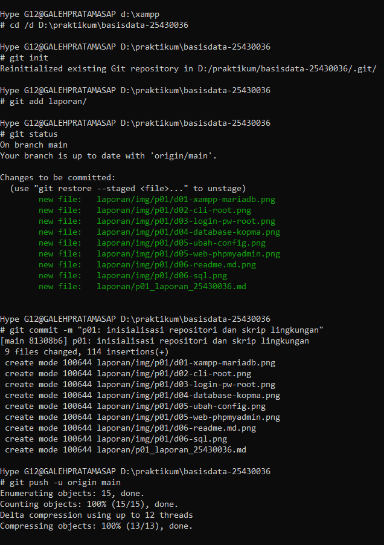
Keterangan:

4. Jawaban Titik Analisis

Titik Analisis 1

...

5. Hasil Latihan dan Modifikasi

E.1
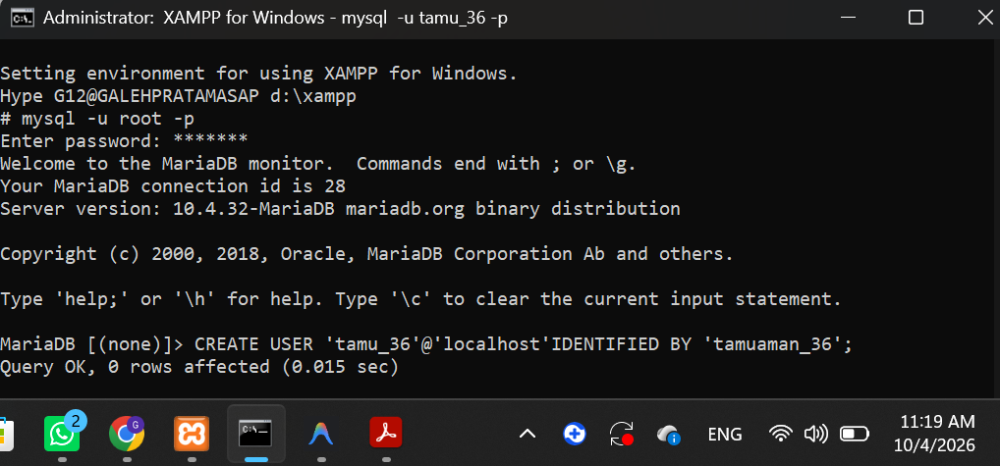
keterangan
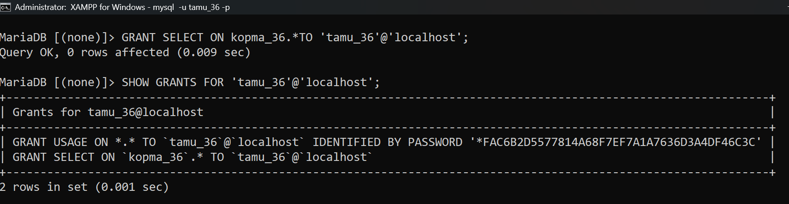
keterangan:
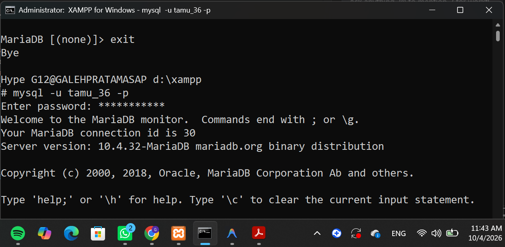
keterangan:
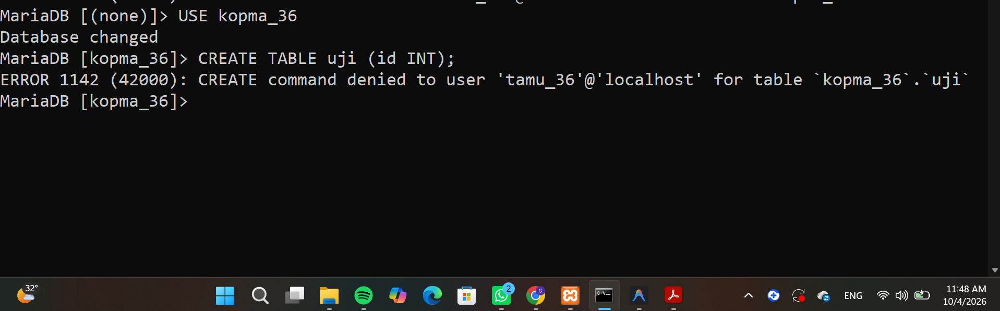
keterangan:

E.2
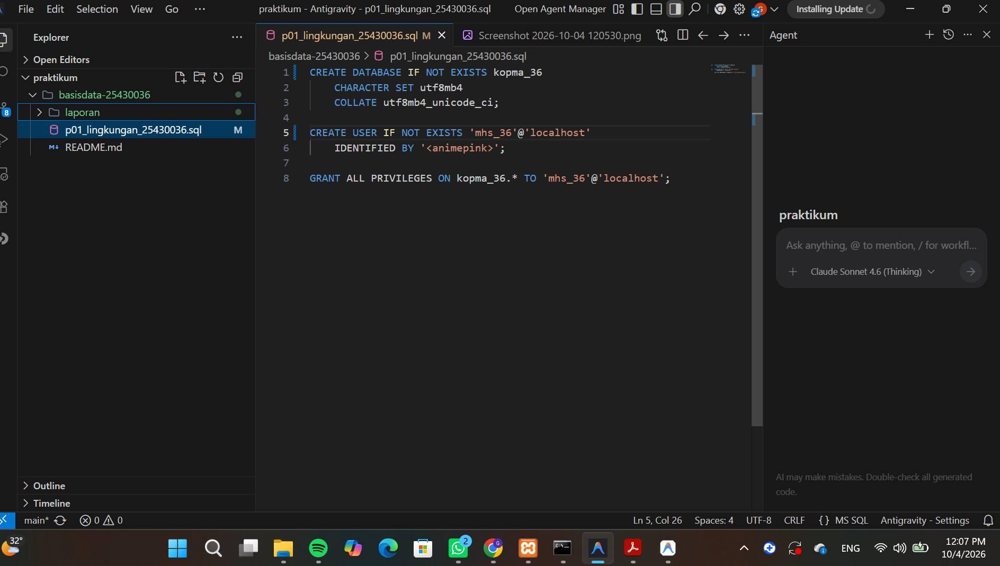
keterangan:
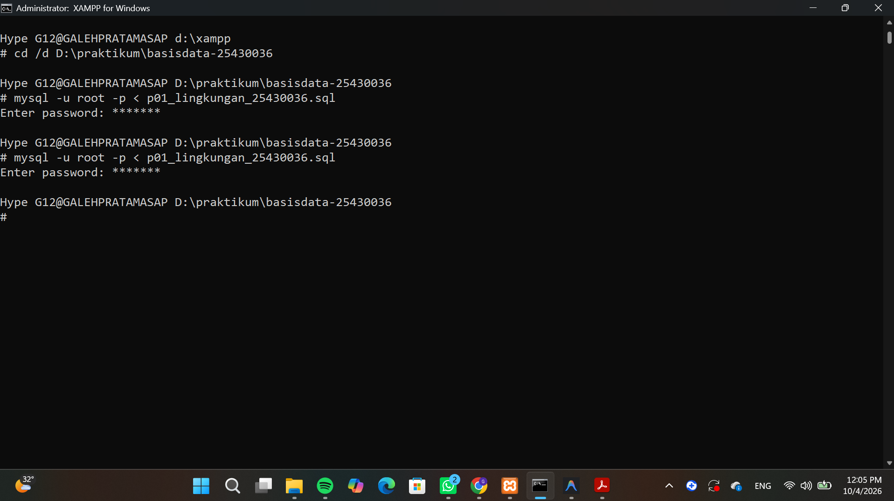
keterangan:

6. Tugas Mandiri: Milestone Proyek 1

F.1

...

## 7. Pembahasan dan Kendala

...

## 8. Kesimpulan

...

## 9. Pernyataan Penggunaan AI

...

## 10. Bukti Git

**Repository:** ...

**Commit:** ...

## Checklist

- [ ] D.1–D.6 selesai
- [ ] Titik Analisis 1–4 dijawab
- [ ] E.1–E.2 selesai
- [ ] Milestone Proyek 1 selesai
- [ ] Bukti screenshot lengkap
- [ ] Git commit dan push