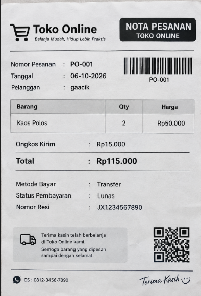

Dokumen kebutuhan data-toko daring

1. Latar belakang dan aktivitas organisasi

Toko daring adalah toko yg menjual barang melalui internet. Pelanggan dapat melihat barang yang tersedia,membuat pesanan,melakukan pembayaran dan menunggu barang di kirim.
Kegiatan yang di lakukan meliputi pengelolaan pelanggan,barang,pesanan,pembayaran dan pengiriman.Data dari kegiatan tersebut perlu di catat agar mudah di cari dan digunakan kembali.

2. Aktor dan proses bisnis

| Kode | Proses Bisnis | Aktor | Pemicu |
| PB-01 | Mengelola data pelanggan | Admin | Ada pelanggan yang membuat atau mengubah akun |
| PB-02 | Mengelola data barang | Admin | Ada barang baru atau data barang berubah |
| PB-03 | Mencatat pesanan | Admin | Pelanggan melakukan pemesanan |
| PB-04 | Mencatat pembayaran | Admin | Pelanggan melakukan pembayaran |
| PB-05 | Mengatur pengiriman | Admin | Pesanan sudah dibayar |
| PB-06 | Mengelola data pemasok | Admin | Ada pemasok baru atau data pemasok berubah |
| PB-07 | Membuat laporan penjualan | Admin | Akhir bulan |

3. Dokumen sumber yang di analisis

Dokumen yang di gunakan sebagai sumber data yaitu:

1. Halaman pesanan
2. Bukti pembayaran
3. resi pengiriman

Dari dokumen tersebut dapat di ketahui beberapa data seperti nomor pesanan,tanggal,pelanggan,barang,jumlah barang,harga,alamat pengiriman,ongkos kirim,pembayaran dan nomor resi.

Dokumen sumber fiktif

Dari nota diatas dapat di ketahui data pelanggan,barang yang di beli,jumlah barang,harga,ongkos kirim,total pembayaran,dan status pembayaran.
Harga barang saat transaksi perlu di simpan karena harga barang bisa berubah.Alamat pengiriman juga perlu di simpan karena alamat yang di gunakan juga bisa berbeda pada pesanan berikutnya. 

4. Entitas kandidat dan elemen data

| Entitas | Elemen Data Utama | Sumber |
| Pelanggan | nomor, nama, HP, email, alamat | Data pelanggan |
| Barang | kode, nama, kategori, harga, stok | Data barang |
| Pesanan | nomor, tanggal, pelanggan, alamat, ongkir, status | Halaman pesanan |
| Detail Pesanan | nomor pesanan, barang, qty, harga | Halaman pesanan |
| Pembayaran | nomor, tanggal, metode, jumlah, status | Bukti pembayaran |
| Pengiriman | nomor, jasa kirim, resi, status | Resi pengiriman |
| Pemasok | kode, nama, HP, alamat | Data pemasok |

5. Aturan bisnis

| Kode | Aturan Bisnis |
| AB-01 | Setiap pesanan mempunyai nomor yang berbeda. |
| AB-02 | Setiap pesanan minimal mempunyai satu barang. |
| AB-03 | Jumlah barang yang dibeli tidak boleh melebihi stok yang tersedia. |
| AB-04 | Harga barang saat transaksi disimpan pada detail pesanan. |
| AB-05 | Ongkos kirim disimpan sesuai dengan pesanan. |
| AB-06 | Alamat pengiriman disimpan sesuai alamat yang digunakan saat memesan. |
| AB-07 | Pesanan hanya dapat dikirim setelah pembayaran berhasil. |
| AB-08 | Pesanan yang sudah dikirim harus mempunyai nomor resi. |
| AB-09 | Stok barang berkurang sesuai jumlah barang yang dibeli. |
| AB-10 | Nomor pelanggan harus berbeda untuk setiap pelanggan. |

6. Kebutuhan informasi

| Kode | Kebutuhan Informasi | Data yang Dibutuhkan |
| KI-01 | Mengetahui jumlah pesanan setiap bulan | Pesanan |
| KI-02 | Mengetahui omzet penjualan setiap bulan | Pesanan, pembayaran |
| KI-03 | Mengetahui barang yang paling banyak terjual | Barang, detail pesanan |
| KI-04 | Mengetahui barang yang stoknya sedikit | Barang |
| KI-05 | Mengetahui pelanggan yang paling banyak berbelanja | Pelanggan, pesanan |
| KI-06 | Mengetahui pesanan yang sudah dibayar | Pesanan, pembayaran |
| KI-07 | Mengetahui pesanan yang sudah dikirim | Pesanan, pengiriman |

7. Matriks CRUD

| Proses | Pelanggan | Barang | Pesanan | Detail Pesanan | Pembayaran | Pengiriman | Pemasok |
| PB-01 Mengelola pelanggan | C,U | | | | | | |
| PB-02 Mengelola barang | | C,U | | | | | |
| PB-03 Mencatat pesanan | R | R | C | C | | | |
| PB-04 Mencatat pembayaran | R | | R,U | R | C,U | | |
| PB-05 Mengatur pengiriman | R | | R,U | R | R | C,U | |
| PB-06 Mengelola pemasok | | | | | | | C,U |
| PB-07 Membuat laporan | R | R | R | R | R | R | R |
Keterangan:
C : Create yaitu membuat data
R : Read yaitu membaca atau melihat data
U : Update yaitu mengubah data
D : Deleat yaitu menghapus data

8. Kamus data awal

| Elemen Data | Arti | Contoh | Aturan | Penanggung Jawab |
| no_pesanan | Nomor untuk membedakan setiap pesanan | PO-001 | Harus unik | Admin |
| tanggal_pesanan | Tanggal pesanan dibuat | 06-10-2026 | Wajib diisi | Admin |
| id_pelanggan | Nomor identitas pelanggan | PLG-001 | Harus unik | Admin |
| nama_pelanggan | Nama pelanggan | gaacik | Wajib diisi | Admin |
| no_hp_pelanggan | Nomor HP pelanggan | 081234567890 | Tidak boleh kosong | Admin |
| alamat_pengiriman | Alamat tujuan barang | Bandar Lampung | Wajib diisi | Admin |
| id_barang | Kode barang | BRG-001 | Harus unik | Admin |
| nama_barang | Nama barang yang dijual | Kaos Polos | Wajib diisi | Admin |
| harga_barang | Harga barang | Rp50.000 | Tidak boleh negatif | Admin |
| qty_barang | Jumlah barang yang dipesan | 2 | Minimal 1 | Admin |
| subtotal | Total harga barang sebelum ongkir | Rp100.000 | Dihitung dari qty × harga | Admin |
| ongkos_kirim | Biaya pengiriman | Rp15.000 | Tidak boleh negatif | Admin |
| total_pembayaran | Jumlah uang yang harus dibayar | Rp115.000 | Subtotal + ongkir | Admin |
| metode_bayar | Cara pelanggan membayar | Transfer | Wajib diisi | Admin |
| status_pembayaran | Status pembayaran pesanan | Lunas | Sesuai kondisi pembayaran | Admin |
| no_resi | Nomor untuk melacak pengiriman | JX1234567890 | Diisi setelah dikirim | Admin |
| status_pengiriman | Kondisi pengiriman barang | Diproses | Sesuai kondisi pesanan | Admin |
| id_pemasok | Kode pemasok barang | SUP-001 | Harus unik | Admin |
| nama_pemasok | Nama pemasok barang | Supplier A | Wajib diisi | Admin |
| stok_barang | Jumlah barang yang tersedia | 20 | Tidak boleh negatif | Admin |
| batas_min_stok | Batas minimum persediaan | 5 | Minimal 0 | Admin |
| tanggal_pembayaran | Tanggal pelanggan membayar | 06-10-2026 | Diisi saat pembayaran | Admin |
| tanggal_pengiriman | Tanggal barang dikirim | 07-10-2026 | Diisi saat dikirim | Admin |
| harga_saat_pesan | Harga barang ketika dipesan | Rp50.000 | Disimpan sesuai transaksi | Admin |
| catatan_pesanan | Catatan tambahan dari pelanggan | Ukuran L | Boleh kosong | Admin |

9. Kebutuhan non-fungsional data

Parameter P

NPM = 25430036

P = (36 mod 9) + 1
P = 1 
Batas maksimal item pertransaksi:

P + 2 = 1 + 2 = 3 item

Perkirakan transaksi per hari:

40 + (5 x P) = 40 + 5 = 45 transaksi

Data transaksi di simpan minimal 5 tahun.Data pribadi pelanggan hanya boleh di lihat oleh admin yang mempunyai izin.

10. Isu kualitas data yang diantisipasi

 Masalah yang mungkin terjadi yaitu data pelanggan tercatat dua kali,jumlah stok di database tidak sesuai dengan stok sebenarnya,harga barang berubah,alamat pengiriman kurang lengkap,atau data pembayaran dan nomor resi belum dicatat. 